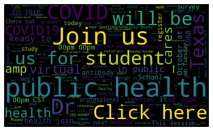
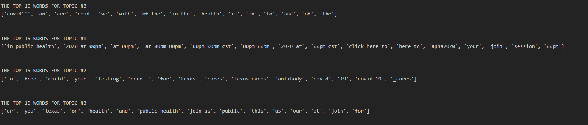
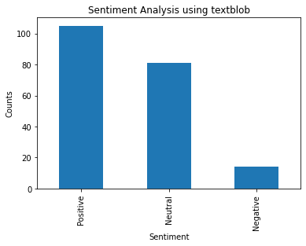
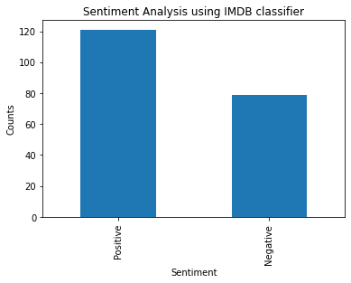

# Sentiment Analysis and topic modeling of tweets

Author: Khush Patel, drpatelkhush@gmail.com

<hr>

# Overview

In the modern era, tweets provide useful information. When unstructured lines of text in tweets are analyzed, a lot of direct and indirect information can be acquired. The information gathered can be utilized to create action plans to enhance how society perceives an organization. Additionally, information on what individuals believe and feel about a subject can be acquired; this knowledge can then be used to inform the development of goods or policies that address the subject. Briefly said, every firm can get useful information from analyzing tweets.

An app based on streamlit is developed and deployed on heroku which takes any twitter handle and analysis the tweets from the handle.

# Table Of Contents

- [Analysis outline](#Analysis-Outline)
- [Code structure](#Code-structure)
- [Requirements](#Requirements)
- [How to cite](#How-to-cite)

<hr>

# Analysis Outline

I analyzed the tweets originating from official handle of UTHealth School of Public health **'UTexasSPH'** to understand what the school is tweeting about and the general sentiments in the tweets and retweets and comments.

Such analysis can be broken down in four basic steps.

<hr>
1. Accessing tweets in a programmatic fashion


<hr>

2. Cleaning the tweets data (removing hyperlinks, @, removing hashtags, removing "RT"...) and developing word clouds.



<hr>

3. Developing topic modeling model which identifies the main topic people are talking about.



Topic Modeling by LDA and NMF showed almost similar results which was surprising. 4 topics I found were : 1st: Related to COVID and we, 2nd: Time and events 3rd: COVID antibody testing 4th: School and join us.

<hr>

4. Developing sentiment analysis model to understand peoeple perception on a topic. We can either use pretrained models or develop a model from scratch. I developed a model using IMDB sentiment analysis data. But such model can be developed from any text with labels.

<hr>



<hr>



<hr>

5. Deployment: Web app can be made using streamlit and deployed on heroku to run the analysis live. User can input any twitter handle and all the above mentioned analysis would be performed.

<hr>

# Code structure

```
├──  configs
│    └── config.py - change data paths, hyperparameters, imports
│
├──  data_preparation.py
│    └── Downloading tweets using API and cleaning the tweets
│
│──word_cloud.py
│    └── Creating word cloud of topics
│
├── sentiment_analysis.py
│    └──Sentiment analysis using textblob and using custom model trained on IMDB dataset
│
├── topic_modeling.py
│      └──Topic modeling: Divide tweets into topics and identifying main topics in each category.
│
├── app_deployment
      └──Files to deploy streamlit app on heroku
```

<hr />

# Requirements

The `requirements.txt` file contains all Python libraries and they will be installed using:

```
pip install -r requirements.txt
```

<hr />

# How to cite

Please contact author (drpatelkhush@gmail.com) for details on reuse of code.
